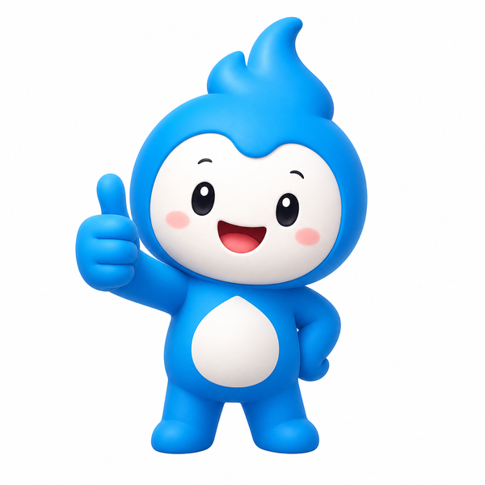
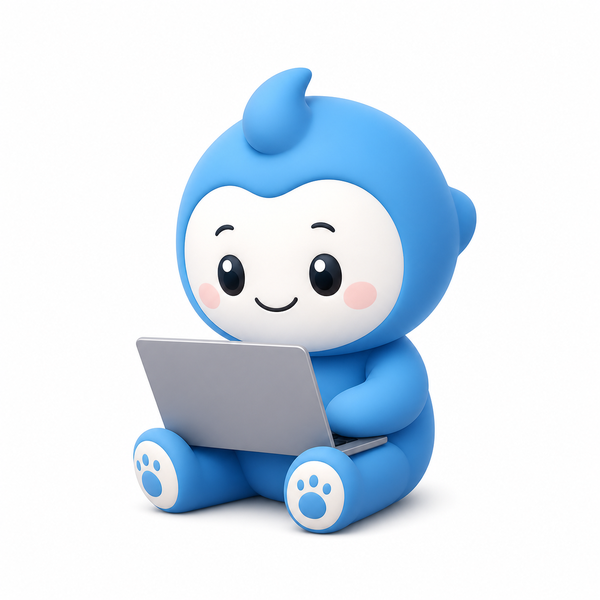

# 🎨 보너스 핸드아웃 — 이미지 만드는 스킬 만들기

> 열정반 특강 · 수업 밖 읽을거리 · 집에서 혼자 해보세요
> © 2026 원성일 · 오즈코딩스쿨

> 이 강의 슬라이드의 그림들 — 로켓, 당근, 은행 금고, 서류철 — 은 전부 AI가 그렸습니다. 사람이 그린 게 아닙니다. 오늘은 그 방법을, **2회차에 만든 스킬 방식 그대로** 여러분 것으로 만듭니다.

---

## 이게 왜 쓸모 있나 (창업가용)

돈 주고 맡기던 것들입니다.

- 상품 사진 — 배경 깔끔한 목업, 연출 컷
- 로고·심볼 — 이름 붙이기 전 시안
- 홍보 그림 — 인스타 배너, 카드뉴스 배경
- 캐릭터·마스코트 — 가게 얼굴

디자이너 외주는 컷당 몇만 원입니다. 완성본을 공짜로 얻는다는 뜻이 아니라, **시안과 초안을 얼마든지 뽑아보고 방향이 잡히면 그때 다듬는다**는 뜻입니다. 검증에 드는 비용이 0이 됩니다.

---

## 준비물 — codex

본 강의를 **codex**로 진행하셨죠? 그 codex 안에 이미지 생성 기능이 들어 있습니다.

- **설치 확인:** 터미널이나 Code 탭에서 `codex --version`을 쳐서 버전이 나오면 설치된 겁니다. 안 나오면 codex부터 설치하세요 (AI에게 "codex cli 설치법 알려줘"라고 물으면 됩니다).
- **로그인 확인:** codex에 로그인돼 있어야 합니다. 그림은 여러분 **GPT 구독**으로 만들어집니다 — 별도 API 키나 카드 등록은 없습니다.

> ✅ **확인:** `codex --version`에 버전이 뜨고, 로그인 상태이면 준비 끝.

---

## 핵심 — "이미지 만들기"를 스킬로

2회차에서 `/check` 스킬 만드신 방식 그대로입니다. **매번 긴 설명을 다시 치지 않도록, 이미지 생성을 명령 하나로 저장**합니다.

**⌨️ 스킬 만들기**
```
codex로 이미지를 생성하는 skill을 만들어줘. 이름은 "codex-image".
내가 "/codex-image [무엇을 어떻게]"라고 하면, 그 설명대로 codex에게 이미지를 만들게 하고
결과 파일을 지금 폴더에 저장해줘.
설명이 부족하면 배경·색·각도·모양을 나한테 되물어서 채운 뒤 진행해줘.
```
> ✅ **확인:** `.claude/skills/codex-image/SKILL.md`가 생기고, 슬래시 목록에 `/codex-image`이 뜨면 성공.

이제 `/codex-image`에 **무엇을 어떻게 만들지만** 붙이면 됩니다. 스킬이 codex 호출을 대신 처리합니다.

**⌨️ 써보기**
```
/codex-image 흰 배경에 원목 원형 식탁, 부드러운 자연광, 위에서 살짝 비껴 본 각도, 가로 사진
```
> ✅ **확인:** 잠시 뒤 PNG 파일이 생기고, 열어보면 그 식탁 사진이 있으면 성공.

---

## 무엇을 어떻게 — 설명하는 법

`/codex-image` 뒤에 붙이는 설명이 결과를 정합니다. **세 가지를 넣으면** 원하는 데 가까워집니다 — 강의 내내 하던 그 얘기입니다.

| 넣을 것 | 예시 |
|---|---|
| **무엇을** | 원목 식탁 · 커피콩 심볼 · 파스텔 배경 |
| **어떤 느낌으로** | 자연광 · 미니멀 · 따뜻한 갈색 |
| **어떤 모양으로** | 가로 사진 · 정사각형 · 세로 |

**응용 예시** (그대로 `/codex-image` 뒤에 붙여 쓰거나, 여러분 사업에 맞게 바꾸세요)

```
/codex-image 커피콩과 찻잔을 합친 미니멀 심볼, 따뜻한 갈색, 흰 배경, 정사각형
```
```
/codex-image 파스텔 그러데이션에 작은 꽃무늬가 흩어진 인스타 배경, 가운데 글자 넣을 여백, 정사각형
```
```
/codex-image 우리 가게 마스코트로 쓸 웃는 당근 캐릭터, 둥글둥글한 3D 점토 느낌, 흰 배경, 정사각형
```

---

## 한 발 더 — 레퍼런스 붙이기

만든 그림을 다음 그림의 **참고**로 붙일 수 있습니다. 같은 캐릭터나 같은 스타일을 유지할 때 씁니다.

아래는 **같은 세 가지(커피 든 모습 · 엄지척 · 노트북)를 뽑은** 결과입니다. 위는 참고 없이, 아래는 강사 캐릭터 사진 한 장을 참고로 붙였습니다.

**참고 없이 — 매번 다른 캐릭터가 나옵니다**

<div class="imgrow">



</div>

**강사 캐릭터를 참고로 붙이면 — 같은 얼굴로 통일됩니다**

<div class="imgrow">


</div>

**⌨️ 이렇게 부탁하면 됩니다**
```
/codex-image 이 사진 속 캐릭터랑 똑같은 얼굴로, 커피잔을 들고 웃는 모습, 흰 배경, 정사각형
(참고 사진 붙이기: 내캐릭터.png)
```
> 캐릭터 하나를 정해두고 참고로 붙이면, 표정·포즈만 바꿔가며 시리즈로 뽑습니다. 브랜드 마스코트를 이렇게 굳힙니다. **이 강의 슬라이드 캐릭터도 사진 한 장으로 이렇게 만들었습니다.**

---

## 두 가지 함정

**글자는 자주 틀립니다.** AI가 그림 안에 글자를 넣으면 철자가 깨질 때가 많습니다. 로고·배너는 **글자 없이 그림만** 뽑고, 글자는 나중에 직접 얹으세요 (캔바·파워포인트 등).

**매번 다르게 나옵니다.** 같은 `/codex-image` 명령도 두 번 치면 두 그림이 다릅니다. 틀린 게 아니라 원래 그렇습니다. AI는 매번 새로 그리거든요. 마음에 들 때까지 다시 부르면 됩니다.

---

## 안 될 때

| 상황 | 대처 |
|---|---|
| `codex --version`이 안 나옴 | codex 미설치 → AI에게 "codex cli 설치법 알려줘" |
| "이미지 생성 도구가 없다"는 답 | codex 로그인이 풀림 → 다시 로그인 후 재시도 |
| 그림이 마음에 안 듦 | 색·조명·각도를 더 구체적으로 붙여 다시 |
| 글자가 깨짐 | 글자 빼고 그림만 → 글자는 따로 얹기 |
| codex를 안 써봤음 | ChatGPT 앱/웹의 "이미지 만들어줘"로도 같은 요령 |

---

*오즈코딩스쿨 7기 열정반 특강 · 보너스 · 검증은 공짜, 마무리는 선택*
